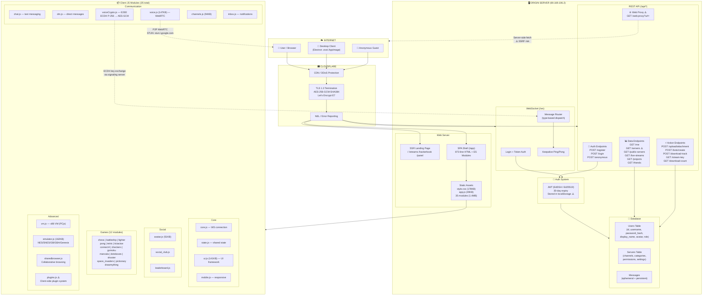
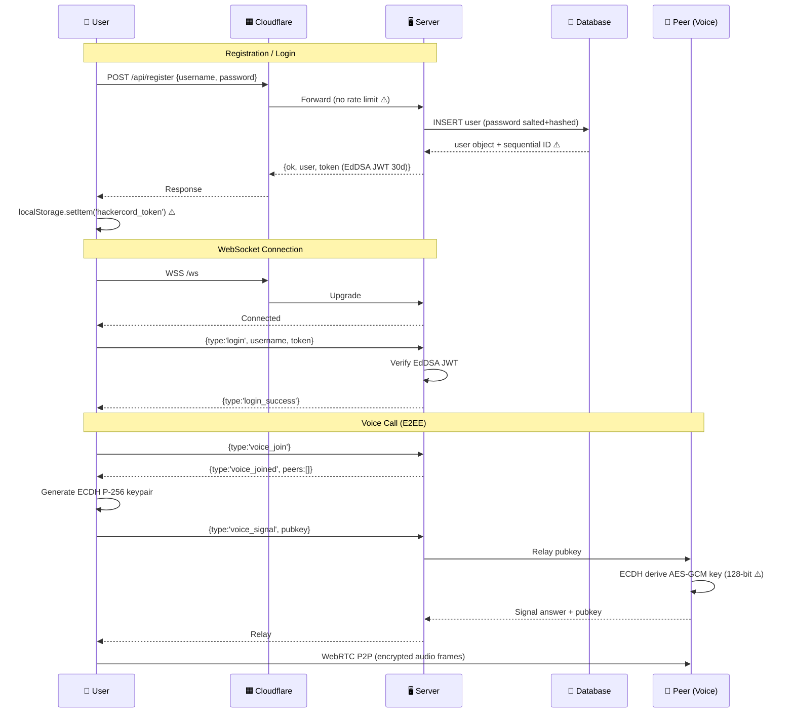
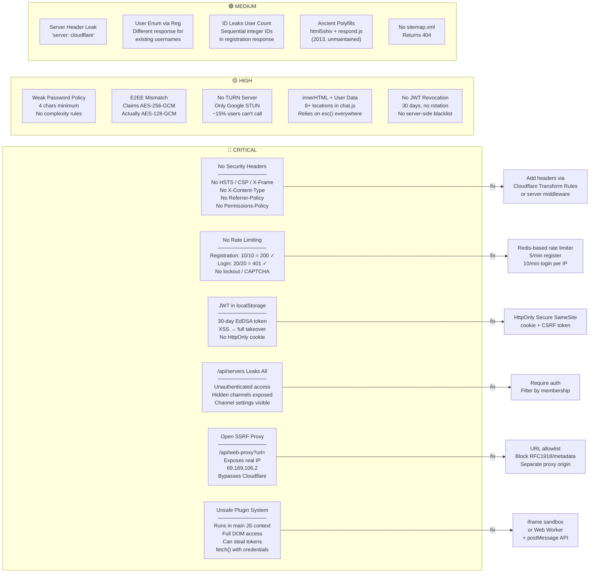

# HackerCord Architecture & Security Audit
> Scanned: 24 February 2026 | Target: hackercord.com | Auditor: NullSec

---

## System Architecture Flowchart



---

## Request Flow



---

## Security Findings Flowchart



---

## Technology Stack

```mermaid
mindmap
  root((HackerCord))
    Infrastructure
      Cloudflare CDN
      TLS 1.3 / Let's Encrypt
      Origin: 69.169.106.2
      NEL Error Reporting
    Backend
      Custom Server
      REST API (11 endpoints)
      WebSocket /ws
      JWT EdDSA Auth
      Server-side Web Proxy
    Frontend
      Vanilla JS (ES Modules)
      No Framework
      35 Modules / 1.4MB
      PWA (manifest.json)
      Single CSS (178KB)
    Communication
      WebSocket JSON Protocol
      WebRTC P2P Voice
      ECDH P-256 Key Exchange
      AES-GCM Encryption
      Google STUN Servers
    Features
      Text Chat (persistent + ephemeral)
      E2EE Voice Calls
      Direct Messages
      Live Streaming
      HackerBook Social Feed
      Project Showcase
      12 Built-in Games
      x86 VM Sharing
      Retro Emulator
      Shared Browser
      Plugin System
      Bot SDK
      Avatar Customizer
      Collaborative Whiteboard
    Security ✅
      EdDSA JWT Signing
      ECDH + AES-GCM Voice E2EE
      XSS esc() Sanitization
      SSRF Partial Blocking
      Generic Login Errors
      Salted Password Hashing
    Security ⚠️
      No HTTP Security Headers
      No Rate Limiting
      JWT in localStorage
      Open Web Proxy SSRF
      Unsafe Plugin Sandbox
      Weak Password Policy
      AES-128 not AES-256
      No TURN Server
```

---

## Priority Fix Matrix

```
┌──────────┬─────────────────────────────────────────────────┬──────────┐
│ Priority │ Fix                                             │ Effort   │
├──────────┼─────────────────────────────────────────────────┼──────────┤
│ 🔴 P0    │ Add HSTS + CSP + X-Frame + X-Content-Type +    │ 1 hour   │
│          │ Referrer-Policy + Permissions-Policy headers    │          │
├──────────┼─────────────────────────────────────────────────┼──────────┤
│ 🔴 P0    │ Rate-limit /api/register and /api/login         │ 2 hours  │
│          │ (5/min per IP)                                  │          │
├──────────┼─────────────────────────────────────────────────┼──────────┤
│ 🔴 P0    │ Move JWT to HttpOnly Secure SameSite cookie     │ 4 hours  │
│          │ + add CSRF token                                │          │
├──────────┼─────────────────────────────────────────────────┼──────────┤
│ 🔴 P0    │ Fix /api/servers: require auth, filter by       │ 1 hour   │
│          │ membership, hide hidden channels                │          │
├──────────┼─────────────────────────────────────────────────┼──────────┤
│ 🔴 P0    │ Harden web-proxy: domain allowlist, block       │ 4 hours  │
│          │ RFC1918/link-local/metadata, separate origin    │          │
├──────────┼─────────────────────────────────────────────────┼──────────┤
│ 🟡 P1    │ Sandbox plugins in iframe/Worker + postMessage  │ 1-2 days  │
├──────────┼─────────────────────────────────────────────────┼──────────┤
│ 🟡 P1    │ Enforce 8+ char passwords with complexity       │ 30 min    │
├──────────┼─────────────────────────────────────────────────┼──────────┤
│ 🟡 P1    │ Fix E2EE: AES-256-GCM (pass {length:256})      │ 30 min     │
│          │ or update marketing to say 128-bit              │          │
├──────────┼─────────────────────────────────────────────────┼──────────┤
│ 🟡 P1    │ Add TURN server for voice reliability           │ 2 hours   │
├──────────┼─────────────────────────────────────────────────┼──────────┤
│ 🟡 P1    │ JWT refresh rotation + server-side revocation   │ 1 day    ─┤
│ 🟢 P2    │ Remove html5shiv/respond.js polyfills           │ 5 min     │
├──────────┼─────────────────────────────────────────────────┼──────────┤
│ 🟢 P2    │ Audit all innerHTML for missing esc() calls     │ 2 hours   │
├──────────┼─────────────────────────────────────────────────┼──────────┤
│ 🟢 P2    │ Add sitemap.xml                                 │ 15 min    │
└──────────┴─────────────────────────────────────────────────┴──────────┘
```

---

## Key Stats

| Metric | Value |
|--------|-------|
| Total JS Modules | 35 |
| Total Client JS | 1,412,686 bytes (1.4MB) |
| API Endpoints | 11 discovered |
| Registered Users | ~51 (sequential IDs) |
| Downloads | 27 |
| Public Servers | 1 (HackerCord official) |
| Built-in Games | 12+ |
| JWT Algorithm | EdDSA (Ed25519) |
| JWT Expiry | 30 days |
| Voice Encryption | ECDH P-256 → AES-GCM 128-bit |
| TLS Version | 1.3 |
| Certificate | Let's Encrypt E7 |
| Origin IP | 69.169.106.2 (exposed via web-proxy) |
| Password Minimum | 4 characters |
| Critical Findings | 6 |
| High Findings | 5 |
| Medium Findings | 5 |
